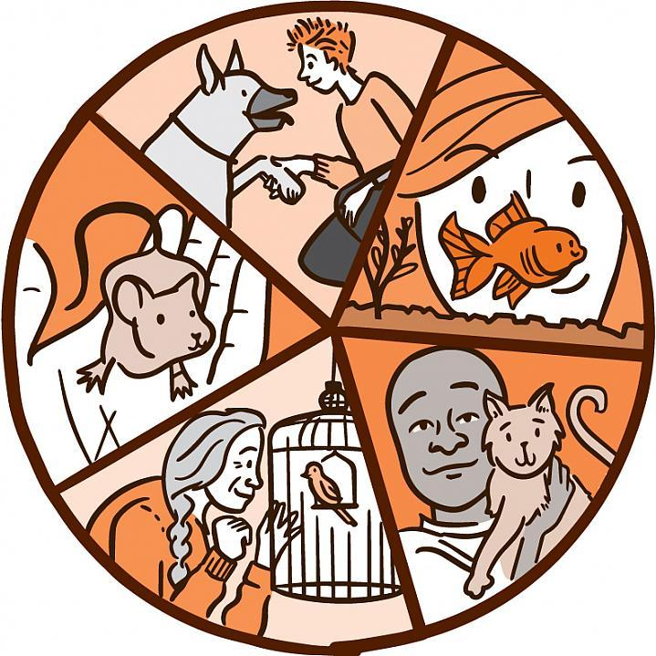
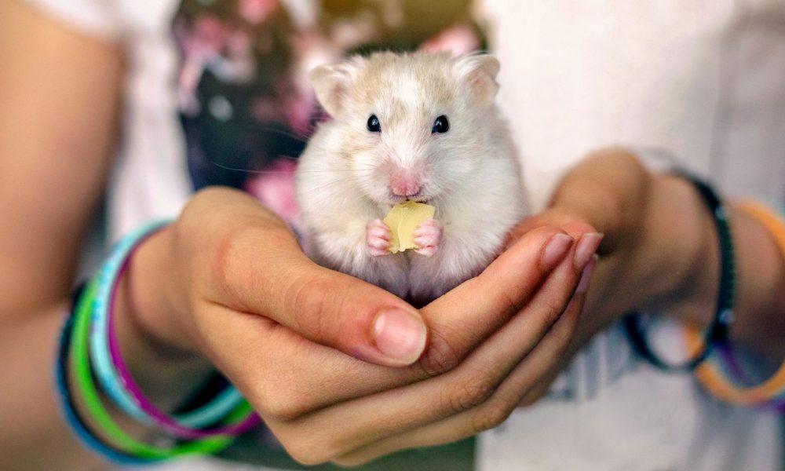
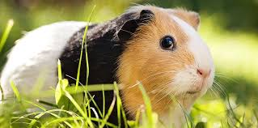
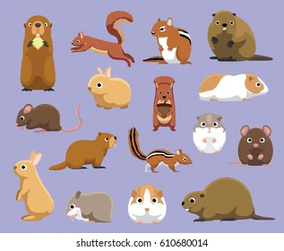
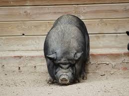
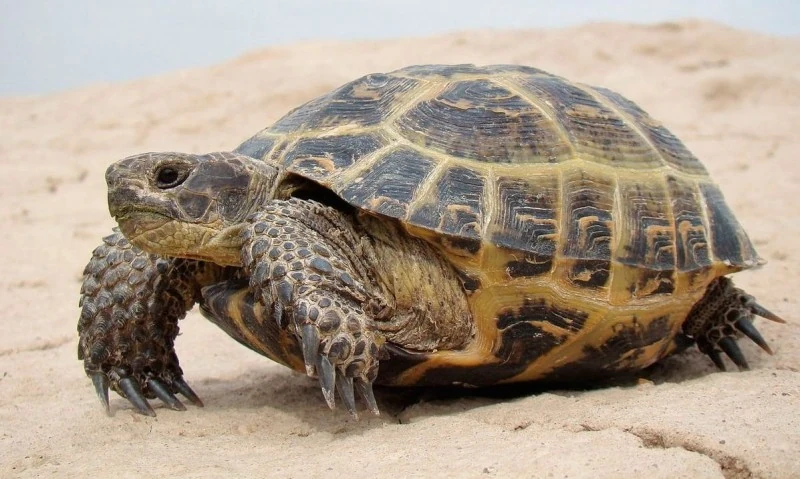
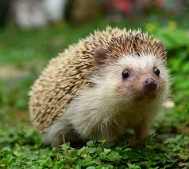
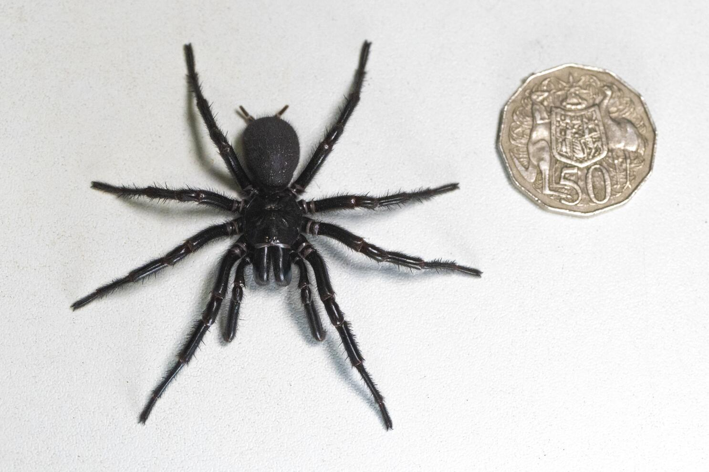
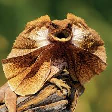
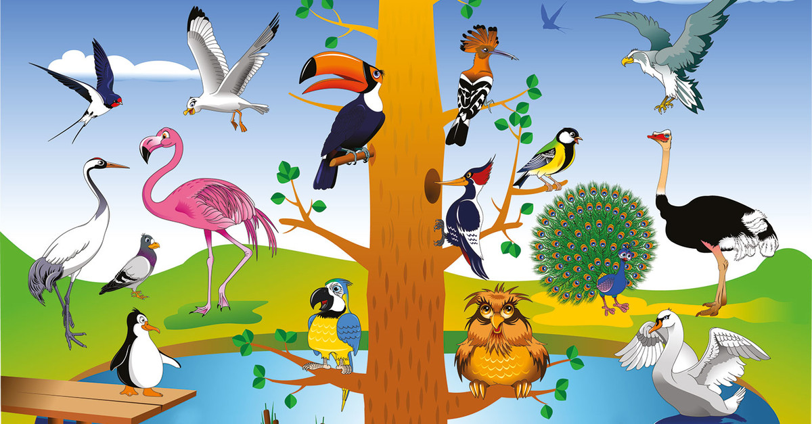

# sitioweb
<!DOCTYPE html>
<html lang="en">
<head>
    <meta charset="UTF-8">
    <meta name="viewport" content="width=device-width, initial-scale=1.0">
</head>
<body>
    <h1> MASCOTAS </h1>
    <h3>Programa por Tayde Alondra Ramos Navarro ft. Laura Galvan Ruiz</h3>
    <h2>
Te mostraremos que tipo de mascotas son las recomendables para tener en el hogar y 
        las mas peligrosas para tenerlas en el hogar.
</h2>
        
        <h3>¿QUE SON?</h3>
        
Las mascotas son aquellos  animales que han sido domesticados para poder habitar el mismo lugar, 
            estos animales no se utilizan para animales de carga o para trabajos simplemente para acompañar a su amo (humano).
        

        
        <h3> TIPOS DE MASCOTAS </h3>
        
A continuacion, mostraremos los tipos de mascotas que son adecuadas para tener en el hogar

        <table border="2">
            <tr>
              <td>Perro</td><td></td>
            </tr>
            <tr>
              <td>Gato doméstico</td><td></td>
            </tr>
            <tr>
              <td>Conejo doméstico</td><td></td>
            </tr>
            <tr>
                <td>Hámster</td><td></td>
              </tr>
              <tr>
                <td>Conejillo de Indias</td><td></td>
              </tr>
        </table>
              
 Mostraremos las mascotas menos adecuadas para tener en el hogar: 

              <ol>
                <li>Roedores
                  <ul>
                    <li>cobayas</li>
                    <li>chinchillas</li>
                    <li>ratones </li>
                    <li></li>
                  </ul>
                </li>
                <li>Cerdos vietnamitas
                  <ul>
                    <li></li>
                  </ul>
                </li>
                <li>Tortugas
                  <ul>
                    <li></li>
                  </ul>
                  </li>
                  <li>Erizos
                    <ul>
                      <li></li>
                    </ul>
                  </li>
                  <li>Arañas
                    <ul>
                      <li></li>
                    </ul>
                  </li>
                  <li>Reptiles exóticos
                    <ul>
                      <li>serpientes</li>
                      <li>iguanas</li>
                      <li>lagartos</li>
                      <li>camaleones</li>
                      <li>geckos</li>
                      <li></li>
                    </ul>
                  </li>
                  <li>Aves
                    <ul>
                      <li>cotorras</li>
                      <li>agapornis</li>
                      <li> periquitos </li>
                      <li>especies de otros países</li>
                      <li></li>
                    </ul>
                  </li>
                </li>
              </ol>
              
 Como debes conocer, las mascotas que no son aptas para ser mascotas, se pueden considerar exoticas, pero puede llegar a ser bastante peligroso tenerlas.

              
 Ahora, por ultimo te daremos unos ultimos consejos para que cuides de manera correcta a tu mascota.

              <ol>
                <li>visita al veterinario</li>
                <li>Proporciona un entorno de vida seguro, cómodo y enriquecedor</li>
                <li>Atiende sus necesidades nutricionales</li>
                  <li>Esteriliza a tu mascota</li>
                  <li> Aplica las vacunas a tiempo</li>
                  <li>Entrenamiento como bienestar</li>
                  <li>Busca juguetes seguros</li>
                <li> Limpia sus patas regularmente</li>
                <li>Lavado de dientes</li>
                <li>Entregarles todo tu amor</li>
              </ol>
              
 Esperamos que la informacion te sirva para el cuidado o seleccion de tu mascota.

</body>
</html>
